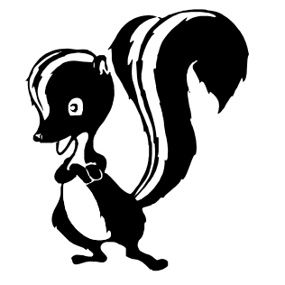
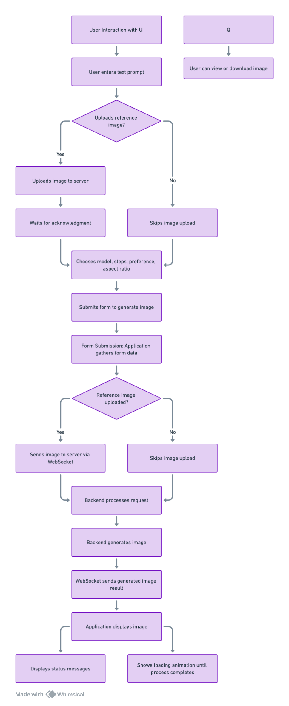

[](https://app.netlify.com/sites/skunkworksai/deploys)
# skunkworks

### Anleitung zur Nutzung des Text-zu-Bild-Generators

Der Text-zu-Bild-Generator ist ein leistungsstarkes Tool, mit dem Sie mithilfe von Textbeschreibungen (Prompts) einzigartige Bilder erstellen können. Diese Anleitung erklärt Ihnen Schritt für Schritt, wie Sie den Generator optimal nutzen und welche Funktionen Ihnen zur Verfügung stehen.

#### 1. Benutzeroberfläche des Generators

Die Benutzeroberfläche des Generators besteht aus mehreren Abschnitten, die Ihnen helfen, Ihre gewünschten Bilder zu erstellen. Im Folgenden finden Sie eine kurze Beschreibung der Hauptkomponenten:

- **Textfeld für Eingaben (Prompt)**: Hier geben Sie Ihre Textbeschreibung ein, auf deren Basis das Bild generiert werden soll. Je genauer und detaillierter die Beschreibung, desto besser das Ergebnis.
- **Referenzbild hochladen**: Sie können ein Bild hochladen, das als Referenz für die Generierung dient. Dies ist besonders hilfreich, wenn Sie ein bestimmtes Bild als Ausgangspunkt verwenden möchten.
- **Optionen zur Bildanpassung**: Wählen Sie Modelle, Präferenzen, Bildgröße und weitere Parameter, um das Ergebnis zu beeinflussen.
- **Generieren-Button**: Startet die Bildgenerierung basierend auf Ihren Einstellungen und Eingaben.

#### 2. Erstellung eines Bildes

##### Schritt 1: Eingabe der Textbeschreibung
Geben Sie in das Textfeld eine detaillierte Beschreibung des gewünschten Bildes ein. Achten Sie darauf, präzise Formulierungen zu verwenden, um das bestmögliche Ergebnis zu erzielen. Zum Beispiel:

*„Eine malerische Landschaft bei Sonnenuntergang, mit Bergen im Hintergrund und einem See im Vordergrund.“*

##### Schritt 2: Auswahl eines Modells
Wählen Sie aus einer Liste von Modellen dasjenige aus, das am besten zu Ihrer Vorstellung passt. Jedes Modell hat unterschiedliche Stärken und kann verschiedene künstlerische Stile oder Detailtreue bieten.

##### Schritt 3: Optionales Hochladen eines Referenzbildes
Falls Sie ein bestimmtes Bild als Ausgangspunkt verwenden möchten, können Sie es hier hochladen. Der Generator wird dieses Bild als Grundlage verwenden und die Beschreibung darauf anwenden.

##### Schritt 4: Anpassung der Parameter
- **Schritte (Steps)**: Bestimmen Sie, wie viele Iterationen der Algorithmus durchlaufen soll. Mehr Schritte führen in der Regel zu detaillierteren Bildern, verlängern aber die Generierungszeit.
- **Bildgröße (Width & Height)**: Legen Sie die Abmessungen des Bildes fest. Einige Modelle funktionieren besser bei bestimmten Größen.
- **Seed**: Der Seed ist eine Zufallszahl, die die Bildgenerierung beeinflusst. Wenn Sie denselben Seed und dieselben Einstellungen verwenden, erhalten Sie jedes Mal dasselbe Bild. Lassen Sie dieses Feld leer für zufällige Ergebnisse.
- **CFG-Skala**: Mit dieser Skala können Sie die Übereinstimmung des Bildes mit Ihrer Beschreibung steuern. Höhere Werte führen zu einer genaueren Abbildung des Prompts, während niedrigere Werte dem Modell mehr kreativen Freiraum geben.

##### Schritt 5: Generierung des Bildes
Klicken Sie auf den „Bild generieren“-Button, um den Generierungsprozess zu starten. Der Status der Generierung wird angezeigt, und nach Abschluss sehen Sie das generierte Bild.

#### 3. Erweiterte Funktionen

##### Verwendung von Kontrollnetzen (ControlNet)
ControlNet ermöglicht es Ihnen, das Bild mit zusätzlichen Eingaben wie Skizzen, Posen oder Segmentierungen genauer zu steuern. Laden Sie dazu eine vorbereitete Guide-Grafik hoch, die als Steuerungselement dient.

##### Verwendung von LoRA (Low-Rank Adaptation)
LoRA-Modelle können verwendet werden, um den generierten Bildern bestimmte Stile oder Merkmale hinzuzufügen. Wählen Sie aus einer Liste verfügbarer LoRA-Modelle aus und passen Sie die Gewichtung an, um den Einfluss auf das Bild zu steuern.

##### Prompt-Gewichtung (Prompt Weighting)
Aktivieren Sie diese Funktion, um bestimmten Wörtern oder Ausdrücken in Ihrem Prompt mehr oder weniger Gewicht zu geben. Sie können die folgende Syntax verwenden, um die Gewichtung festzulegen:

- **Erhöhung der Aufmerksamkeit**: Beispiel: `kleiner+ Hund, (Pixar-Stil)`
- **Mehrere Symbole für mehr Effekt**: Beispiel: `kleiner+++ Hund, Pixar-Stil`
- **Verschachtelte Gewichtung**: Beispiel: `(kleiner+ Hund)++, Pixar-Stil`
- **Explizite Gewichtung**: Beispiel: `kleiner Hund, (Pixar-Stil)1.2`

Sie können auch mehrere Prompts kombinieren, indem Sie sie zusammenführen oder in separate Abschnitte unterteilen:

- **Mischen**: Beispiel: `("kleiner Hund", "Roboter").blend(1, 0.8)`
- **Verbindung**: Beispiel: `("kleiner Hund", "Pixar-Stil").and()`

#### 4. Best Practices für Text-Prompts

- **Tun**: Verwenden Sie detaillierte und spezifische Beschreibungen, um das gewünschte Ergebnis zu erzielen. Zum Beispiel: „Ein roter Oldtimer auf einer Straße in der Wüste, mit Palmen im Hintergrund.“
- **Nicht tun**: Vermeiden Sie zu kurze oder vage Beschreibungen wie „Auto“. Dies führt oft zu weniger präzisen Ergebnissen.

#### 5. Beispiel-Workflows

##### Workflow 1: Einfaches Text-zu-Bild
1. Geben Sie eine detaillierte Beschreibung ein: „Ein futuristischer Roboter, der in einem neonbeleuchteten Stadtbild steht.“
2. Wählen Sie das Modell „RealVisXL V4.0“.
3. Belassen Sie die Seed-Eingabe leer für zufällige Ergebnisse.
4. Klicken Sie auf „Bild generieren“ und sehen Sie sich das Ergebnis an.

##### Workflow 2: Verwendung eines Referenzbildes
1. Laden Sie ein Bild eines Autos hoch.
2. Geben Sie den Prompt ein: „Ein Auto in einer verschneiten Landschaft“.
3. Wählen Sie das Modell „epiCRealism“ und aktivieren Sie die Verwendung des Referenzbildes.
4. Klicken Sie auf „Bild generieren“.

##### Workflow 3: Feinabstimmung mit Prompt-Gewichtung
1. Geben Sie einen komplexen Prompt ein: „Ein + kleiner Hund, (Pixar-Stil)1.2, (Comic-Stil)-“
2. Wählen Sie das Modell „SocaRealism XL“.
3. Aktivieren Sie „Prompt-Gewichtung“ und passen Sie die Gewichtung an.
4. Klicken Sie auf „Bild generieren“.

#### 6. Weitere Tipps

- **Experimente**: Testen Sie verschiedene Modelle und Parameter, um den besten Stil für Ihre Anforderungen zu finden.
- **Kontinuität**: Verwenden Sie denselben Seed und dieselben Einstellungen, um Variationen eines Themas zu erstellen.

Mit dieser Anleitung sind Sie bestens gerüstet, um den Text-zu-Bild-Generator erfolgreich zu nutzen und beeindruckende Ergebnisse zu erzielen!
## Flow Chart

#### **Roadmap:**
Based on the screenshot you provided, here's the updated project structure reflecting the contents of your project:

```
├── dist/                           # Production build output
│   ├── css/                        # Compiled CSS files
│   ├── fonts/                      # Compiled font files
│   ├── js/                         # Compiled JavaScript files
│   ├── favicon.ico                 # Favicon for the application
│   ├── index.html                  # Main HTML file for production
│   └── Skunk_works_Logo.svg        # Project logo
│
├── node_modules/                   # Project dependencies (auto-generated)
│
├── public/                         # Public assets, accessible without bundling
│   ├── favicon.ico                 # Favicon for the application
│   ├── index.html                  # Main HTML file for development
│   └── Skunk_works_Logo.svg        # Project logo
│
├── readme_assets/                  # Assets used in documentation (e.g., logos)
│   ├── 05_09_flow.png              # Example flow image for documentation
│   └── Skunk_works_Logo.svg        # Project logo
│
├── src/                            # Main source code directory
│   ├── assets/                     # Static assets (fonts, styles, etc.)
│   │   ├── fonts/                  # Font files
│   │   │   ├── JetBrainsMono-Bold.woff2
│   │   │   ├── JetBrainsMono-BoldItalic.woff2
│   │   │   ├── JetBrainsMono-ExtraBold.woff2
│   │   │   ├── JetBrainsMono-ExtraBoldItalic.woff2
│   │   │   ├── JetBrainsMono-ExtraLight.woff2
│   │   │   ├── JetBrainsMono-ExtraLightItalic.woff2
│   │   │   ├── JetBrainsMono-Italic.woff2
│   │   │   ├── JetBrainsMono-Light.woff2
│   │   │   ├── JetBrainsMono-LightItalic.woff2
│   │   │   ├── JetBrainsMono-Medium.woff2
│   │   │   ├── JetBrainsMono-MediumItalic.woff2
│   │   │   ├── JetBrainsMono-Regular.woff2
│   │   │   ├── JetBrainsMono-SemiBold.woff2
│   │   │   ├── JetBrainsMono-SemiBoldItalic.woff2
│   │   │   ├── JetBrainsMono-Thin.woff2
│   │   │   └── JetBrainsMono-ThinItalic.woff2
│   │   └── styles.css              # Global styles
│   │
│   ├── components/                 # Vue.js components
│   │   ├── ImageGenerator.vue      # Component for image generation
│   │   └── ImageModal.vue          # Modal component for displaying images
│   │
│   ├── services/                   # Utility services and helper functions
│   │   ├── generation.ts           # Image generation logic
│   │   ├── types.ts                # TypeScript type definitions
│   │   ├── utils.ts                # Utility functions
│   │   └── websocket.ts            # WebSocket management
│   │
│   ├── App.vue                     # Root Vue.js component
│   ├── main.ts                     # Entry point for the Vue.js app
│   └── shims-vue.d.ts              # TypeScript definitions for .vue files
│
├── .browserslistrc                 # Browser compatibility configuration
├── .env                            # Environment variables
├── .gitignore                      # Git ignored files
├── babel.config.js                 # Babel configuration
├── package-lock.json               # Auto-generated, locks dependency versions
├── package.json                    # Project dependencies and scripts
├── postcss.config.js               # PostCSS configuration (used with Tailwind CSS)
├── README.md                       # Project documentation
├── tailwind.config.js              # Tailwind CSS configuration
├── tsconfig.json                   # TypeScript compiler options
└── vue.config.js                   # Vue CLI configuration
```

##### **Phase 1: Current Features**
- **Image Generator Interface**:
  - User inputs text prompt.
  - User uploads reference image (optional).
  - User selects model, steps, preference, and aspect ratio.
  - Image generation based on text or reference image (img2img).
  
- **WebSocket Communication**:
  - WebSocket setup for sending/receiving generation requests and handling images.
  
- **Image Output & History**:
  - Displays generated images.
  - Shows last 4 generated images.
  
- **Image Download/Preview**:
  - Option to view and download generated images.

##### **Phase 2: Improvements & Next Steps**
- **Tooltip UI Enhancements**:
  - Add tooltips for better user guidance, starting with concise descriptions for the 'steps' input.
  
- **Placeholder Replacement Logic**:
  - Ensure placeholders are replaced dynamically by the last 4 generated images in the UI.
  
- **Language Support Fix**:
  - Solve issues related to language switching in your TYPO3 CMS project.
  
- **Deprecated Tech Updates**:
  - Address deprecated PHP and outdated TYPO3 versions in your other project, deciding whether to upgrade or rebuild as a static page.
  
##### **Phase 3: Long-term Enhancements**
- **Improved Image Generation Control**:
  - Add advanced controls for image generation, such as seed management and fine-tuning for better quality results.
  
- **WebSocket Resilience**:
  - Enhance WebSocket connection stability and automatic reconnection strategies for better real-time performance.

- **Improved Image History**:
  - Add a feature to download a zip of previous 4 images.
  
- **Scalability Enhancements**:
  - Plan to scale the backend for handling larger image generation volumes.

These phases will help you progressively improve the app and address both UI and backend technical issues, while also aligning with your focus on minimal changes to maintain stability.

### Text-to-Image
- **Status**: **Working**  
- The `Text-to-Image` generation is functioning as expected. Users can input a text prompt, and the application generates an image based on that prompt.

### Image-to-Image (img2img)
- **Status**: **Working**  

To help you plan your roadmap towards the goal of allowing users to choose between **img2img** and **text2img**, here’s a structured approach that balances stability improvements and feature development.

### 1. **Stabilize the Current Code**
   Before adding new features, you need to ensure the current implementation is robust. Here are key areas to improve:

   #### Code Improvements
   - **WebSocket Error Handling:** **Working**  
     Ensure better error handling around WebSocket connections. For instance, handle cases where the WebSocket might close unexpectedly, and reinitialize the connection smoothly.
     
     **Action:** Implement retries and better connection state monitoring.
     
   - **Timeouts and Fail-Safes:** **Working**  
     Ensure that timeouts (currently set to 30 seconds) are consistently managed. If an image generation task takes longer than expected, you should provide better feedback to the user.
     
     **Action:** Add retries or error messages when timeouts occur.

   - **Memory Optimization:**
     Check the handling of large image files, especially when the user uploads a reference image. Ensure that the application doesn’t run into memory issues when handling multiple images.
     
     **Action:** Optimize how images are stored and handled in memory (use compression or lazy loading techniques).

   - **UI Feedback:**
     Currently, the status message and loading indicators work, but adding visual cues, like progress bars or spinners, would improve the user experience.
     
     **Action:** Add more intuitive feedback elements during image generation.

   - **Prevent Multiple Submissions:**
     If the user clicks "Generate Image" multiple times, it could trigger multiple generation requests. Prevent this by disabling the button or queuing requests.

     **Action:** Disable the submit button or show a message indicating a request is already in progress.

---

### 2. **Implement Selection Between img2img and text2img**
   Once stability is improved, you can start working on the feature that allows users to choose between the two modes.

   #### Feature Development:
   - **Design a Toggle System:**
     Create a UI component (radio buttons, toggle switch, or dropdown) where the user can select between img2img or text2img modes.
     
     **Action:** Add a new state variable (e.g., `generationMode` with values `img2img` or `text2img`) and adjust the form accordingly.

   - **Dynamic Form Adjustments:**
     When img2img is selected, show the image upload section and the relevant controls (e.g., strength slider). When text2img is selected, hide the image upload controls.
     
     **Action:** Use conditional rendering to display or hide form fields based on the selected mode.

   - **Validation and State Management:**
     Make sure that when switching between img2img and text2img, the state (uploaded image, input text, etc.) is handled gracefully without resetting unnecessarily.

     **Action:** Implement reactive form handling and data persistence between mode changes.

---

### 3. **Testing and Feedback Loop**
   After implementing the new feature, ensure that you have proper testing in place:
   
   - **User Testing:** Perform tests with real users to get feedback on the flow and ensure both modes (img2img and text2img) work as expected.
   
   - **Edge Case Testing:** Ensure that users cannot submit a form with incomplete information, such as missing prompts or missing reference images.

   - **Error and Performance Monitoring:** Set up logging or tracking mechanisms to capture any errors or performance issues in the image generation process.

---

### Roadmap Summary

1. **Stabilization (1-2 weeks)**
   - Improve WebSocket error handling
   - Add better timeouts and error messages
   - Optimize memory usage for image handling
   - Enhance UI feedback and prevent multiple submissions

2. **Feature Implementation (2-3 weeks)**
   - Create a toggle for img2img vs text2img
   - Dynamically adjust the form based on the selection
   - Ensure proper state management and validation

3. **Testing and Feedback (1 week)**
   - Perform edge case and user testing
   - Monitor for errors and performance issues


## Project setup

```bash
npm install
```

### Compiles and hot-reloads for development

```bash
npm run serve
```

### Compiles and minifies for production

```bash
npm run build
```

### Customize configuration

See [Configuration Reference](https://cli.vuejs.org/config/).


usePromptWeighting
boolean
Default: false
Allow setting different weights per words or expressions in prompts.

Adds 0.2 seconds to image inference time and incurs additional costs.

When weighting is enabled, you can use the following syntax in prompts:

Weighting

Syntax: + - (word)0.9

Increase or decrease the attention given to specific words or phrases.

Examples:

Single words: small+ dog, pixar style
Multiple words: small dog, (pixar style)-
Multiple symbols for more effect: small+++ dog, pixar style
Nested weighting: (small+ dog)++, pixar style
Explicit weight percentage: small dog, (pixar)1.2 style
Blend

Syntax: .blend()

Merge multiple conditioning prompts.

Example: ("small dog", "robot").blend(1, 0.8)

Conjunction

Syntax: .and()

Break a prompt into multiple clauses and pass them separately.

Example: ("small dog", "pixar style").and()
