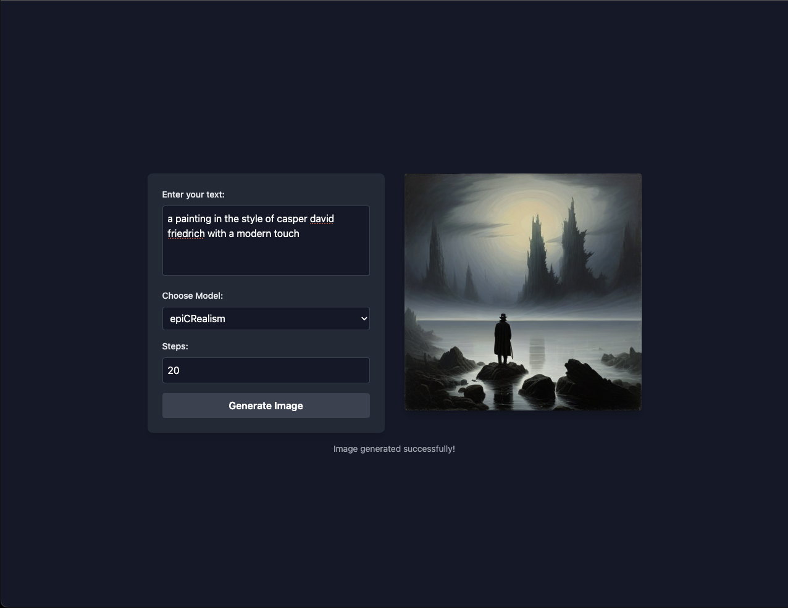
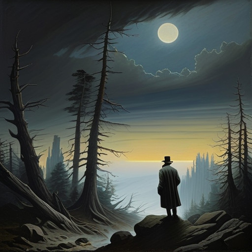
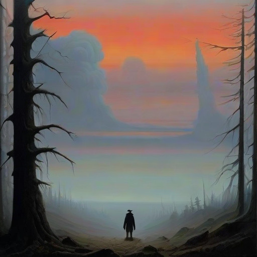

# skunkworks



This project is a work in progress. Stay tuned for updates!

## Example Images

Here are some examples of the images generated by the project:




## Project setup
```
npm install
```

### Compiles and hot-reloads for development
```
npm run serve
```

### Compiles and minifies for production
```
npm run build
```

### Customize configuration
See [Configuration Reference](https://cli.vuejs.org/config/).


## Next Up 

-  widht and hight
-  resultion 
-  dif. Models 
-  download 
-  1 result 


## 